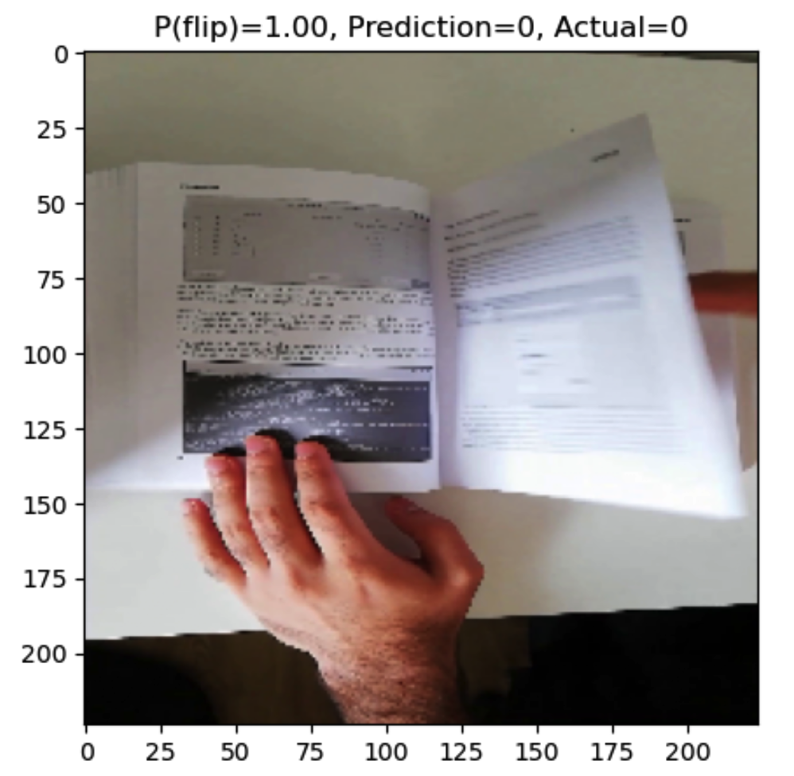

# Image Classification Model

This project develops a machine learning model for classification tasks in the field of computer vision. I am focusing on detecting a page flip from low-resolution images captured from the mobile. This repository contains two jupyter notebook scripts, that train a three-layer CNN model on the low-resolution images of a book from the mobile. The trained model extracts the relevant features and patterns from the low-resolution image and classifies them as 'flip' and 'not flip'.

The two notebooks differ only in the data processing step, `CNN_model_with_data_augmentation.ipynb` implements data augmentation to create a robust model and increase model performance. Both models perform well on the training and testing datasets. Finally, Gradient-weighted Class Activation Mapping (Grad-CAM) is implemented on the output of the final convolutional layer in the network, which examines the gradient information flowing into the final layer.

Here, is an example of a low-resolution image along with the prediction probability and prediction from CNN model.

